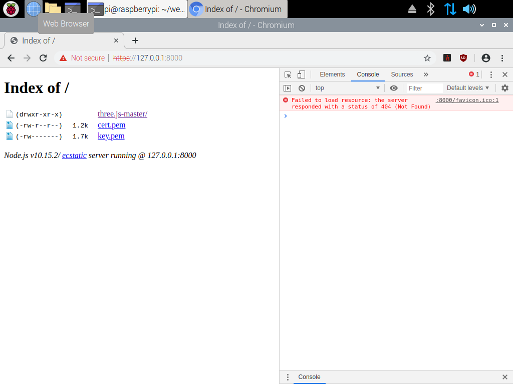

# Threejs-WebXR-67P

Visualize the size of comet 67P/Churyumov-Gerasimenko in Oculus Quest.


Rosetta 1km from 67P comet.


Rosetta 10km from 67P comet.

This project was inspired by a European Space Agency's webpage explaining the relative size of the Rosetta space probe to comet 67P/Churyumov-Gerasimenko:
 
[ESA: How big is Rosetta compared with the comet?](http://sci.esa.int/rosetta/54831-how-big-is-rosetta-compared-with-the-comet/)
 
With ESA and NASA open sourcing their data such as 3D models and images, Three.js, a web browser with WebXR, and Blender can be used to visualize models of a comet (4100m) and Rosetta (32m) in virtual reality.

# Threejs-WebXR-67P Pages

[https://physicslibrary.github.io/Threejs-WebXR-67P](https://physicslibrary.github.io/Threejs-WebXR-67P)

# Hardware

Oculus Quest recommended (6DoF headset/controllers).<br>

# Software

Oculus Browser (tested Quest Update >17.0).<br>

# Installation

No installation. In Oculus Quest, open Oculus Browser and go to link:

[https://physicslibrary.github.io/Threejs-WebXR-67P/examples/67P-Rosetta-1-to-100-scale.html](https://physicslibrary.github.io/Threejs-WebXR-67P/examples/67P-Rosetta-1-to-100-scale.html)

[https://physicslibrary.github.io/Threejs-WebXR-67P/examples/67P-Rosetta-1-to-1-scale.html](https://physicslibrary.github.io/Threejs-WebXR-67P/examples/67P-Rosetta-1-to-1-scale.html)

With Oculus Quest's headset 6DoF tracking, freely look around Rosetta/67P within Oculus Guardian system. Use Oculus Touch controllers to go to areas out of reach.<br>

Use Oculus Touch controllers to "fly" around Rosetta and comet 67P. It implements a simple way to move around 3D by making a "velocity vector" from left to right controllers.<br>

The distance between controllers is the speed (next to each other is the lowest speed).<br>

Press one front trigger to move (two triggers to double speed).<br>

Hold the left controller fixed and point the right controller in the direction to move.<br>

The simple "fly" code is based on webxr_vr_ballshooter.html.<br>

Note - The white lines from the controllers are not for pointing direction to move but with seeing where the controllers are. Each line is approx 1m in length.<br>

Other buttons on controllers do not work, yet.<br>

If no Oculus Quest, try: (tested on 2018 9.7" iPad/iPadOS 13/Safari, Windows 10/Google Chrome/Firefox)

[https://physicslibrary.github.io/Threejs-WebXR-67P/examples/67P-Rosetta-1-to-100-scale-novr.html](https://physicslibrary.github.io/Threejs-WebXR-67P/examples/67P-Rosetta-1-to-100-scale-novr.html)

# Credits
 
ESA\_Gaia\_DR2\_AllSky\_Brightness\_Colour\_Cartesian\_2000x1000.png<br>
Date: 25 April 2018<br>
Satellite: Gaia<br>
Copyright: ESA/Gaia/DPAC, CC BY-SA 3.0 IGO<br>
[http://sci.esa.int/gaia/60196-gaia-s-sky-in-colour-equirectangular-projection/](http://sci.esa.int/gaia/60196-gaia-s-sky-in-colour-equirectangular-projection/)<br>
 
CSHP\_DV\_257\_01\_\_\_\_\_\_\_00343.obj (OBJ File 3.8MB)<br>
Copyright: ESA/Rosetta/NAVCAM – CC BY-SA IGO 3.0<br>
[https://imagearchives.esac.esa.int/index.php?/page/navcam_3d_models](https://imagearchives.esac.esa.int/index.php?/page/navcam_3d_models)<br>
[https://imagearchives.esac.esa.int/index.php?/page/copyright_information](https://imagearchives.esac.esa.int/index.php?/page/copyright_information)<br>

Rosetta.blend (Rosetta.zip 4MB)<br>
Author/Origin: Eyes on the Solar System. NASA/JPL-Caltech<br>
[https://nasa3d.arc.nasa.gov/detail/eoss-rosetta](https://nasa3d.arc.nasa.gov/detail/eoss-rosetta)<br>
[https://www.nasa.gov/multimedia/guidelines/index.html](https://www.nasa.gov/multimedia/guidelines/index.html)<br>

Blender 2.81 (or latest) is used to scale CSHP\_DV\_257\_01\_\_\_\_\_\_\_00343.obj to 4100m and exported as "glTF Binary" 67P.glb. 

Rosetta.blend (2012 version) is opened with Blender 2.81, fixed few broken things, and exported as "glTF Binary" rosetta.glb.
 
https://www.blender.org/

km_markers.glb is created in Blender as a series of 10x10x10m cubes spaced by 1km to give a sense of distance.

# References

[https://threejs.org/](https://threejs.org/)

[https://github.com/mrdoob/three.js/](https://github.com/mrdoob/three.js/)

Three.js examples is a fantastic place to learn and experiment:

[https://github.com/mrdoob/three.js/tree/dev/examples](https://github.com/mrdoob/three.js/tree/dev/examples)

How to convert WebGL examples to WebVR:

[https://threejs.org/docs/index.html#manual/en/introduction/How-to-create-VR-content](https://threejs.org/docs/index.html#manual/en/introduction/How-to-create-VR-content)

How to use the controllers:

[https://github.com/mrdoob/three.js/blob/dev/examples/webxr_vr_ballshooter.html](https://github.com/mrdoob/three.js/blob/dev/examples/webxr_vr_ballshooter.html)

How to load .glb file:

[https://github.com/mrdoob/three.js/blob/dev/examples/webgl_loader_gltf.html](https://github.com/mrdoob/three.js/blob/dev/examples/webgl_loader_gltf.html)

Near the end of the webpage is an example of displaying an equirectangular map:

[https://threejsfundamentals.org/threejs/lessons/threejs-backgrounds.html](https://threejsfundamentals.org/threejs/lessons/threejs-backgrounds.html)

[https://www.blender.org/](https://www.blender.org/)

[Rosetta and comet 67P to scale](https://sci.esa.int/web/rosetta/-/54829-rosetta-and-comet-67p-to-scale-annotated)

# Making Threejs-WebXR-67P (Feb 10, 2020)

# (Update) Feb 20, 2021. This section shows how to use a Raspberry Pi (with built-in wifi) to serve a webpage to an Oculus Quest. "sudo apt-get install http-server -g" is not working on latest Raspberry Pi OS. An alternative is websocketd to serve a webpage (websocketd can pipe sensor readings from a Raspberry Pi gpio to a websocket easily with python or C.<br>

This section assumes users know what a Raspberry Pi single-board computer is and how to use a Linux terminal. Threejs-WebXR-67P is developed on a Raspberry Pi Model 3B+ by coding three.js html5 files.<br>

The following link is for reference. This is where the author first learned about Node.js http-server.<br>

[https://threejs.org/docs/index.html#manual/en/introduction/How-to-run-things-locally](https://threejs.org/docs/index.html#manual/en/introduction/How-to-run-things-locally)

Raspberry Pi Model 3B+ has an ethernet port and wireless LAN. We will be making the Pi into a wifi server to connect the Oculus Quest. Learn more about Raspberry Pi at:

[https://www.raspberrypi.org/](https://www.raspberrypi.org/)

[https://www.raspberrypi.org/help/](https://www.raspberrypi.org/help/)

Get Raspberry Pi OS ~~Buster~~ with desktop ~~(tested February 2020, 1138 MB version)~~ from:

[https://www.raspberrypi.org/software/operating-systems/#raspberry-pi-os-32-bit](https://www.raspberrypi.org/software/operating-systems/#raspberry-pi-os-32-bit)

Make a bootable Raspbian micro SD card:

[https://www.raspberrypi.org/documentation/installation/installing-images/README.md](https://www.raspberrypi.org/documentation/installation/installing-images/README.md)

Connect to the internet using the ethernet port. The wireless LAN will be reconfigured and not available for internet connection.

After booting Raspbian and finishing initial setup, configure Pi as a wireless access point:

[https://www.raspberrypi.org/documentation/configuration/wireless/access-point-routed.md](https://www.raspberrypi.org/documentation/configuration/wireless/access-point-routed.md)

In "Configure the access point software", make own NameOfNetwork and good password for wpa_passphrase. The author skips section "Enable routing and IP masquerading" to keep thing simple (so no internet access from Pi wireless LAN but apt-get work with ethernet). This is useful in developing and serving three.js from a Raspberry Pi with Oculus Quest wifi connected.<br>

Review Terminal:

[https://www.raspberrypi.org/documentation/usage/terminal/](https://www.raspberrypi.org/documentation/usage/terminal/)

~~In a Terminal, run:~~

~~sudo apt-get install npm~~

~~sudo apt-get install http-server -g~~

~~(Ref: [https://www.npmjs.com/package/http-server](https://www.npmjs.com/package/http-server))~~

In a terminal (in home directory),

cd ~

mkdir webvr<br>

cd webvr<br>

openssl req -newkey rsa:2048 -new -nodes -x509 -days 3650 -keyout key.pem -out cert.pem<br>

The command is from the preceeding link in section "TLS/SSL".

Open Chromium, and go to:

[https://threejs.org/](https://threejs.org/)

Click "download" to download master.zip.

After download is completed, extract master.zip to webvr.

~~In webvr directory, type:~~

~~http-server . -p 8000 -S~~

One way to serve a webpage from a Raspberry Pi is websocketd.<br>

http://websocketd.com/ (more on https://github.com/joewalnes/websocketd)<br>

Websocketd is used in another project (https://github.com/Physicslibrary/Threejs-VR-Sensors) to read sensors from Pi gpio to an Oculus Quest browser.

There is a Linux ARM version for the Raspberry Pi in "Download".<br>

Put websocketd in webvr directory with key.pem and cert.pem.<br>

./websocketd --port=8000 --ssl --sslkey=key.pem --sslcert=cert.pem --staticdir=.<br>

(ctrl-c to end program)<br>

In Chromium, enter ```https://127.0.0.1:8000``` and should get a warning "Your connection is not private". Proceed in "Advanced" as you are connecting to your own Raspberry Pi.

Should look like the left side:



The right side is Chromium console (ctrl-shift-i) which is useful for debugging javascript codes.

If the above work, wifi connect Oculus Quest to Pi, open Oculus Browser, enter ```https://192.168.4.1:8000```.


Try three.js-master/examples/webxr_vr_ballshooter.html:


<br>Copyright (c) 2019 Hartwell Fong
