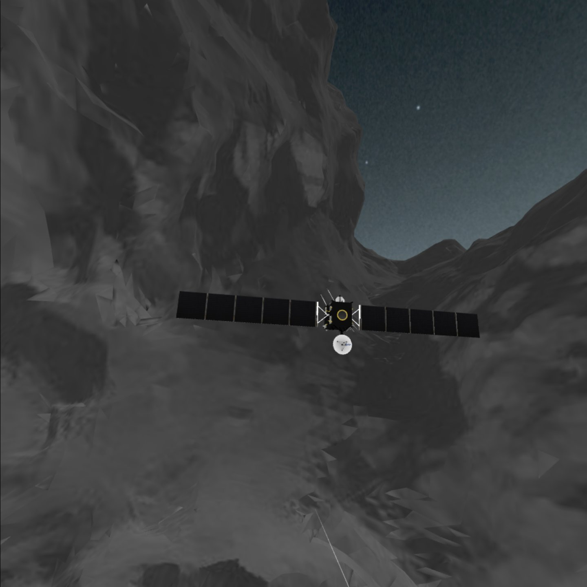

# Threejs-WebXR-67P

Visualize the size of comet 67P/Churyumov-Gerasimenko in Oculus Quest.

Rosetta 1km from 67P comet.

Rosetta 10km from 67P comet.

This project was inspired by a European Space Agency's webpage explaining the relative size of the Rosetta space probe to comet 67P/Churyumov-Gerasimenko:
 
[ESA: How big is Rosetta compared with the comet?](http://sci.esa.int/rosetta/54831-how-big-is-rosetta-compared-with-the-comet/)
 
With ESA and NASA open sourcing their data such as 3D models and images, Three.js, a modern web browser with WebXR, and Blender can be used to visualize models of a comet (4100m) and Rosetta (31m) in virtual reality.

# Threejs-WebXR-67P Pages

[https://physicslibrary.github.io/Threejs-WebXR-67P](https://physicslibrary.github.io/Threejs-WebXR-67P)

# Hardware

Oculus Quest recommended (required 6DOF headset/controllers). 

# Software

Oculus Browser (Oculus Quest Firmware update 12.0 or latest, supporting WebXR).

# Installation

No installation. In Oculus Quest, open Oculus Browser and go to link:

[https://physicslibrary.github.io/Threejs-WebXR-67P/examples/67P-Rosetta-1-to-100-scale.html](https://physicslibrary.github.io/Threejs-WebXR-67P/examples/67P-Rosetta-1-to-100-scale.html)

[https://physicslibrary.github.io/Threejs-WebXR-67P/examples/67P-Rosetta-1-to-1-scale.html](https://physicslibrary.github.io/Threejs-WebXR-67P/examples/67P-Rosetta-1-to-1-scale.html)

With Oculus Quest's headset 6DOF tracking, freely walk around Rosetta/67P within Oculus Guardian system. Use Oculus Touch controllers to go to areas out of reach. 

Use Oculus Touch controllers to "fly" around Rosetta and comet 67P. It implements a simple way to move around 3D by making a "velocity vector" from left to right controllers. 

The distance between controllers is the speed (next to each other is the lowest speed). 

Press one front trigger to move (two triggers to double speed). 

Hold the left controller fixed and point the right controller in the direction to move. 

The simple "fly" code is based on webvr_vr_ballshooter.html before the recent three.js update to WebXR in December 2019. 

Note - The white lines from the controllers are not meant for pointing direction to move but with seeing where the controllers are (codes from webvr_vr_ballshooter.html). The line is approx 1m in length so it good for something like getting rough measurement of Rosetta. 

Other buttons on controllers do not work, yet. 

# Credits
 
ESA\_Gaia\_DR2\_AllSky\_Brightness\_Colour\_Cartesian\_2000x1000.png 
Date: 25 April 2018 
Satellite: Gaia 
Copyright: ESA/Gaia/DPAC, CC BY-SA 3.0 IGO 
[http://sci.esa.int/gaia/60196-gaia-s-sky-in-colour-equirectangular-projection/](http://sci.esa.int/gaia/60196-gaia-s-sky-in-colour-equirectangular-projection/) 
 
CSHP\_DV\_257\_01\_\_\_\_\_\_\_00343.obj (OBJ File 3.8MB) 
Copyright: ESA/Rosetta/NAVCAM – CC BY-SA IGO 3.0 
[https://imagearchives.esac.esa.int/index.php?/page/navcam_3d_models](https://imagearchives.esac.esa.int/index.php?/page/navcam_3d_models) 
[https://imagearchives.esac.esa.int/index.php?/page/copyright_information](https://imagearchives.esac.esa.int/index.php?/page/copyright_information) 

Rosetta.blend (Rosetta.zip 4MB) 
Author/Origin: Eyes on the Solar System. NASA/JPL-Caltech 
[https://nasa3d.arc.nasa.gov/detail/eoss-rosetta](https://nasa3d.arc.nasa.gov/detail/eoss-rosetta) 
[https://www.nasa.gov/multimedia/guidelines/index.html](https://www.nasa.gov/multimedia/guidelines/index.html) 

Blender 2.81 (or latest) is used to scale CSHP\_DV\_257\_01\_\_\_\_\_\_\_00343.obj to 4100m and exported as "glTF Binary" 67P.glb. 

Rosetta.blend (2012 version) is opened with Blender 2.81, fixed few broken things, and exported as "glTF Binary" rosetta.glb.
 
https://www.blender.org/

km_markers.glb is created in Blender as a series of 10x10x10m cubes spaced by 1km to give a sense of distance.

# References

[https://threejs.org/](https://threejs.org/)

[https://github.com/mrdoob/three.js/](https://github.com/mrdoob/three.js/)

Three.js examples is the best place to learn and experiment:

[https://github.com/mrdoob/three.js/tree/dev/examples](https://github.com/mrdoob/three.js/tree/dev/examples)

Three.js' excellent documentation on how to convert WebGL examples to WebVR:

[https://threejs.org/docs/index.html#manual/en/introduction/How-to-create-VR-content](https://threejs.org/docs/index.html#manual/en/introduction/How-to-create-VR-content)

Three.js example of how to use the controllers:

[https://github.com/mrdoob/three.js/blob/dev/examples/webxr_vr_ballshooter.html](https://github.com/mrdoob/three.js/blob/dev/examples/webxr_vr_ballshooter.html)

Three.js example of how to load .glb file:

[https://github.com/mrdoob/three.js/blob/dev/examples/webgl_loader_gltf.html](https://github.com/mrdoob/three.js/blob/dev/examples/webgl_loader_gltf.html)

Near the end of the webpage is an example of displaying an equirectangular map:

[https://threejsfundamentals.org/threejs/lessons/threejs-backgrounds.html](https://threejsfundamentals.org/threejs/lessons/threejs-backgrounds.html)

[https://www.blender.org/](https://www.blender.org/)

[Rosetta and comet 67P to scale](https://sci.esa.int/web/rosetta/-/54829-rosetta-and-comet-67p-to-scale-annotated)

# Making Threejs-WebXR-67P

Blender 2.81 to import 3D models CSHP\_DV_257\_01\_\_\_\_\_\_\_00343.obj and Rosetta.blend and exported in format that Three.js can read.

Copyright (c) 2019 Hartwell Fong
